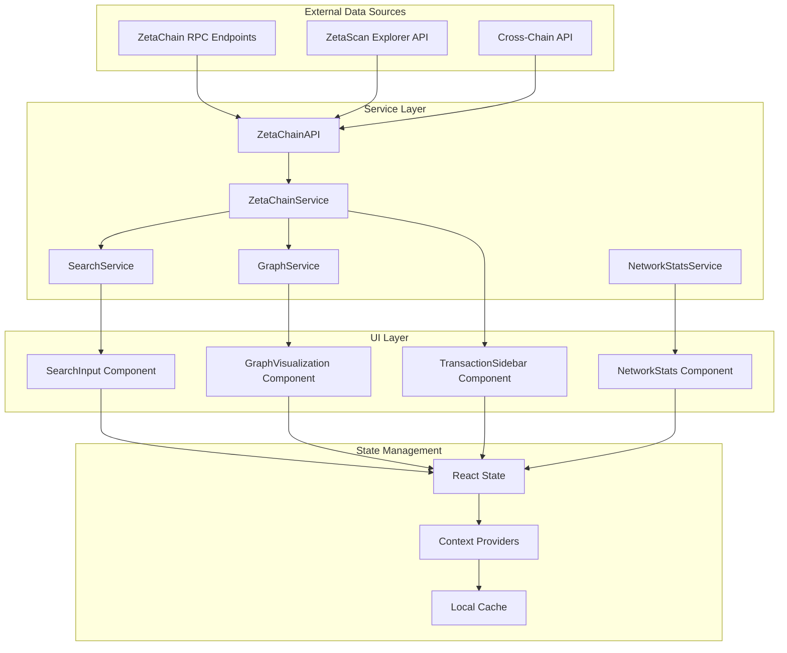
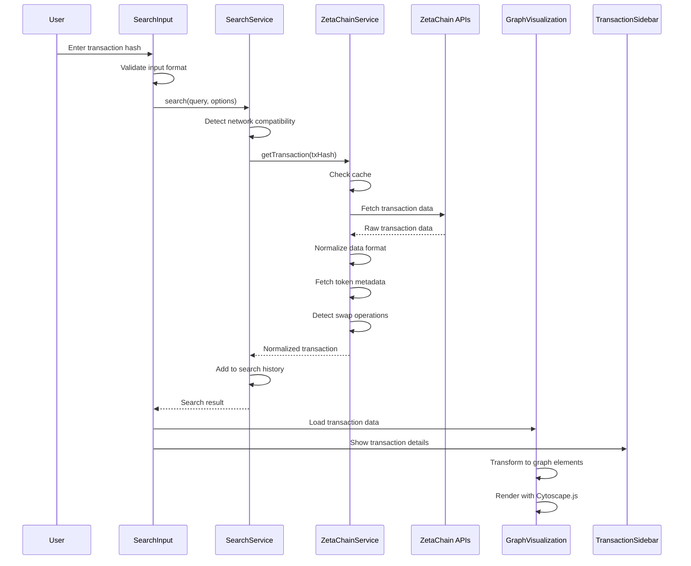
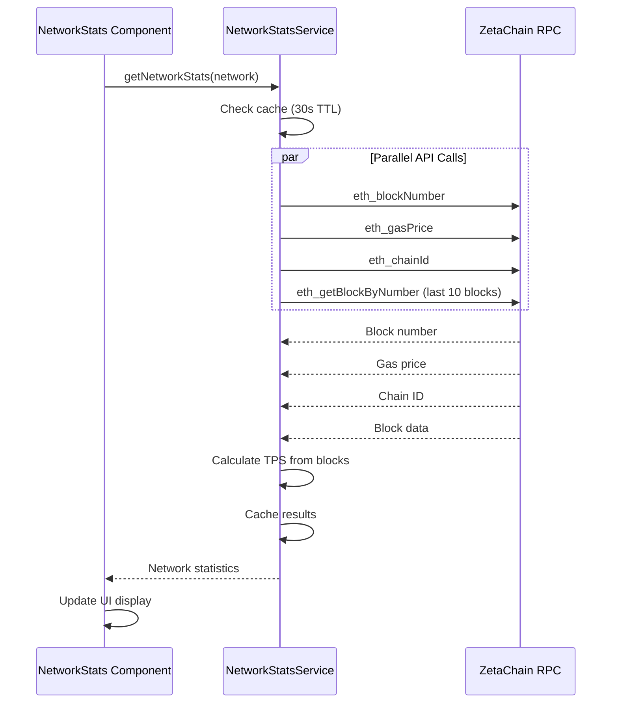

# ZetaFlow Architecture - Data Flow Documentation

## Overview

ZetaFlow is a Next.js 15 application that visualizes cross-chain transactions on the ZetaChain ecosystem. This document outlines the complete data flow architecture from external APIs to the frontend visualization.

## High-Level Architecture



## Detailed Data Flow

### 1. Data Sources Layer

#### ZetaChain RPC Endpoints
- **Mainnet**: `https://zetachain-evm.blockpi.network/v1/rpc/public`
- **Testnet**: `https://zetachain-athens-evm.blockpi.network/v1/rpc/public`
- **Purpose**: Direct blockchain data access for EVM transactions
- **Data Types**: Transaction details, receipts, block information, gas prices

#### ZetaScan Explorer API
- **Mainnet**: `https://zetascan.com`
- **Testnet**: `https://testnet.zetascan.com`
- **Purpose**: Pre-indexed cross-chain transaction data
- **Data Types**: Cross-chain transaction relationships, chain mappings

#### Cross-Chain API
- **Mainnet**: `https://zetachain.blockpi.network/lcd/v1/public/zeta-chain/crosschain/cctx/`
- **Testnet**: `https://zetachain-athens.blockpi.network/lcd/v1/public/zeta-chain/crosschain/cctx/`
- **Purpose**: ZetaChain-specific cross-chain transaction data
- **Data Types**: Cross-chain transaction status, multi-chain flows

### 2. Service Layer Architecture

#### ZetaChainAPI (Low-Level API Wrapper)
```javascript
// Location: src/lib/blockchain/zetachain-api.js
class ZetaChainAPI {
  // Direct API calls to ZetaChain endpoints
  async getEVMTransaction(txHash, isMainnet)
  async getEVMTransactionReceipt(txHash, isMainnet)
  async getCrossChainTransaction(txHash, isMainnet)
  detectTransactionType(zetascanUrl)
}
```

#### ZetaChainService (Application Service Layer)
```javascript
// Location: src/lib/blockchain/zetachain-service.js
class ZetaChainService {
  // High-level service with caching, retry logic, and error handling
  async getTransaction(txHashOrUrl)
  async getTransactionWithReceipt(txHash)
  normalizeEVMTransaction(evmTx, receipt)
  normalizeCrossChainTransaction(ccTx)
  
  // Features:
  // - Automatic retry with exponential backoff
  // - In-memory caching (5-minute TTL)
  // - Network switching (mainnet/testnet)
  // - Token metadata fetching
  // - Swap detection
  // - Error wrapping and classification
}
```

#### SearchService (Search Orchestration)
```javascript
// Location: src/lib/search/SearchService.js
class SearchService {
  // Orchestrates search operations with validation and network suggestions
  async search(query, options)
  async searchByTransactionHash(txHash)
  async searchByAddress(address)
  
  // Features:
  // - Input validation (TxID vs Address)
  // - Network mismatch detection
  // - Search history management
  // - Toast notification integration
  // - Caching with TTL
}
```

#### GraphService (Visualization Processing)
```javascript
// Location: src/lib/visualization/GraphService.js
class GraphService {
  // Transforms transaction data into graph elements
  transformTransactionData(transactions)
  loadData(transactions)
  applyLayout(layoutName)
  
  // Features:
  // - Cytoscape.js integration
  // - Multiple layout algorithms (fcose, dagre, cose-bilkent)
  // - Node/edge styling
  // - Export functionality (PNG/JSON)
}
```

#### NetworkStatsService (Network Monitoring)
```javascript
// Location: src/lib/network/NetworkStatsService.js
class NetworkStatsService {
  // Fetches real-time network statistics
  async getNetworkStats(network)
  async getBlockNumber(rpcUrl)
  async getGasPrice(rpcUrl)
  async calculateTPS(rpcUrl, currentBlock)
  
  // Features:
  // - 30-second caching
  // - Parallel metric fetching
  // - Error fallback handling
}
```

### 3. Data Flow Sequence

#### Transaction Search Flow


#### Network Statistics Flow


### 4. Component Architecture

#### Main Page Component (src/app/page.js)
```javascript
export default function Home() {
  // State Management
  const [networkMode, setNetworkMode] = useState("testnet");
  const [selectedTransaction, setSelectedTransaction] = useState(null);
  const [graphTransactions, setGraphTransactions] = useState([]);
  const [sidebarTransaction, setSidebarTransaction] = useState(null);
  
  // Event Handlers
  const handleSearch = async (query, type) => {
    const searchService = getSearchService(networkMode);
    const searchResult = await searchService.search(query, {
      notificationHandler: { showError, showWarning, showInfo, showSuccess }
    });
    
    // Update state with results
    setGraphTransactions(searchResult.data);
    setSidebarTransaction(searchResult.data[0]);
    setShowVisualization(true);
  };
  
  const handleNodeClick = (nodeData) => {
    if (nodeData.type === 'transaction') {
      setSidebarTransaction(nodeData.txData);
    }
  };
}
```

#### SearchInput Component (src/components/search/SearchInput.js)
```javascript
export default function SearchInput({ onSearch, isLoading, placeholder }) {
  // Real-time validation
  const validation = useMemo(() => validateInput(inputValue), [inputValue]);
  
  // Input types: 'txid' | 'address' | 'invalid' | 'empty'
  const validateInput = (input) => {
    const txHashRegex = /^(0x)?[a-fA-F0-9]{64}$/;
    const addressRegex = /^(0x)?[a-fA-F0-9]{40}$/;
    
    if (txHashRegex.test(input.trim())) return { isValid: true, type: "txid" };
    if (addressRegex.test(input.trim())) return { isValid: true, type: "address" };
    return { isValid: false, type: "invalid", error: "Invalid format" };
  };
}
```

#### GraphVisualization Component (src/components/visualization/GraphVisualization.js)
```javascript
export default function GraphVisualization({ 
  transactions, 
  onNodeClick, 
  onEdgeClick, 
  layout 
}) {
  // Initialize Cytoscape.js
  useEffect(() => {
    graphServiceRef.current = new GraphService();
    const cy = graphServiceRef.current.initialize(containerRef.current);
    
    // Event handlers
    graphServiceRef.current.on('tap', 'node', (event) => {
      onNodeClick(event.target.data());
    });
  }, []);
  
  // Load transaction data
  useEffect(() => {
    if (graphServiceRef.current && transactions.length) {
      graphServiceRef.current.loadData(transactions);
    }
  }, [transactions]);
}
```

### 5. Data Transformation Pipeline

#### Raw Transaction Data → Normalized Format
```javascript
// Input: Raw ZetaChain API response
{
  "hash": "0x1234...",
  "from": "0xabcd...",
  "to": "0xefgh...",
  "value": "1000000000000000000",
  "gasPrice": "20000000000",
  "blockNumber": "0x123456"
}

// Output: Normalized transaction object
{
  txHash: "0x1234...",
  from: "0xabcd...",
  to: "0xefgh...",
  value: "1000000000000000000",
  gasPrice: "20000000000",
  blockNumber: 1193046,
  status: "success",
  chainId: 7001,
  type: "evm",
  network: "testnet",
  tokenTransfers: [...],
  swapInfo: {...},
  evmData: {...}
}
```

#### Normalized Transaction → Graph Elements
```javascript
// Input: Normalized transaction
{
  txHash: "0x1234...",
  from: "0xabcd...",
  to: "0xefgh...",
  type: "cross-chain",
  crossChainData: {
    sourceChain: 1,
    destinationChain: 7001
  }
}

// Output: Cytoscape.js elements
{
  nodes: [
    { data: { id: "addr_0xabcd", type: "address", label: "0xab...cd" } },
    { data: { id: "tx_0x1234", type: "transaction", label: "0x12...34" } },
    { data: { id: "chain_1", type: "chain", label: "Ethereum" } },
    { data: { id: "chain_7001", type: "chain", label: "ZetaChain Testnet" } }
  ],
  edges: [
    { data: { source: "addr_0xabcd", target: "tx_0x1234", type: "transaction" } },
    { data: { source: "chain_1", target: "chain_7001", type: "cross_chain" } }
  ]
}
```

### 6. Caching Strategy

#### Multi-Level Caching
```javascript
// 1. ZetaChainService Cache (5 minutes)
this.cache.set(cacheKey, {
  data: result,
  timestamp: Date.now()
});

// 2. SearchService Cache (1 minute)
this.searchCache.set(cacheKey, {
  result,
  timestamp: Date.now()
});

// 3. NetworkStatsService Cache (30 seconds)
this.cache.set(cacheKey, {
  data: stats,
  timestamp: Date.now()
});
```

#### Cache Keys Format
```javascript
// ZetaChainService: "getTransaction:mainnet:["0x1234..."]"
// SearchService: "mainnet:txid:0x1234..."
// NetworkStats: "stats_mainnet"
```

### 7. Error Handling & Network Switching

#### Error Classification
```javascript
export const ERROR_TYPES = {
  NETWORK_ERROR: "NETWORK_ERROR",
  TRANSACTION_NOT_FOUND: "TRANSACTION_NOT_FOUND", 
  INVALID_INPUT: "INVALID_INPUT",
  API_RATE_LIMIT: "API_RATE_LIMIT",
  TIMEOUT: "TIMEOUT"
};
```

#### Network Mismatch Detection
```javascript
// Detect likely network from transaction hash patterns
detectTransactionNetwork(txHash) {
  const firstBytes = txHash.substring(2, 10);
  const mainnetIndicators = [
    /^[0-9a-f]{2}[0-9]{2}/.test(firstBytes),
    parseInt(firstBytes, 16) > 0x80000000
  ];
  
  if (mainnetScore > testnetScore) {
    return { likelyNetwork: 'mainnet', confidence: 'medium' };
  }
}
```

#### Toast Notification Integration
```javascript
// SearchService shows network switch suggestions
showSearchErrorNotification(error, notificationHandler, query) {
  if (error.originalError?.networkMismatch) {
    notificationHandler.showError(error.message, {
      action: {
        label: `Switch to ${error.originalError.suggestedNetwork}`,
        onClick: () => notificationHandler.onNetworkSwitch(targetNetwork)
      }
    });
  }
}
```

### 8. Performance Optimizations

#### Lazy Loading & Code Splitting
```javascript
// Dynamic imports for heavy components
const GraphVisualization = dynamic(() => import('./GraphVisualization'), {
  loading: () => <div>Loading graph...</div>
});
```

#### Parallel API Calls
```javascript
// Fetch transaction and receipt simultaneously
const [txResult, receiptResult] = await Promise.all([
  this.api.getEVMTransaction(txHash, isMainnet),
  this.api.getEVMTransactionReceipt(txHash, isMainnet)
]);
```

#### Retry Logic with Exponential Backoff
```javascript
async executeWithRetry(fn, operation) {
  for (let attempt = 0; attempt <= this.retryConfig.maxRetries; attempt++) {
    try {
      return await fn();
    } catch (error) {
      if (attempt === this.retryConfig.maxRetries) throw error;
      
      const delay = this.retryConfig.baseDelay * Math.pow(2, attempt);
      await this.sleep(Math.min(delay, this.retryConfig.maxDelay));
    }
  }
}
```

### 9. State Management Flow

#### React Context Providers
```javascript
// Toast Provider for notifications
export function ToastProvider({ children }) {
  const [toasts, setToasts] = useState([]);
  
  const showError = (message, options) => {
    const toast = { id: Date.now(), type: 'error', message, ...options };
    setToasts(prev => [...prev, toast]);
  };
}

// Query Provider for API caching (if using TanStack Query)
export function QueryProvider({ children }) {
  const queryClient = new QueryClient({
    defaultOptions: {
      queries: { staleTime: 5 * 60 * 1000 } // 5 minutes
    }
  });
}
```

#### Component State Synchronization
```javascript
// Main page orchestrates state between components
const handleSearch = async (query, type) => {
  const result = await searchService.search(query);
  
  // Update multiple components
  setGraphTransactions(result.data);      // → GraphVisualization
  setSidebarTransaction(result.data[0]);  // → TransactionSidebar
  setShowVisualization(true);             // → UI state
};

const handleNodeClick = (nodeData) => {
  setSidebarTransaction(nodeData.txData); // → TransactionSidebar
};
```

### 10. Real-time Features

#### Network Statistics Updates
```javascript
// Auto-refresh every 30 seconds
useEffect(() => {
  const interval = setInterval(() => {
    fetchNetworkStats();
  }, 30000);
  
  return () => clearInterval(interval);
}, [networkMode]);
```

#### Live Transaction Status
```javascript
// Poll transaction status for pending transactions
const pollTransactionStatus = async (txHash) => {
  const maxAttempts = 10;
  for (let i = 0; i < maxAttempts; i++) {
    const tx = await zetaChainService.getTransaction(txHash);
    if (tx.status !== 'pending') return tx;
    await new Promise(resolve => setTimeout(resolve, 5000));
  }
};
```

## Summary

ZetaFlow's architecture provides a robust, scalable foundation for cross-chain transaction visualization:

1. **Layered Architecture**: Clear separation between data sources, services, and UI
2. **Comprehensive Caching**: Multi-level caching reduces API calls and improves performance
3. **Error Resilience**: Retry logic, fallbacks, and user-friendly error messages
4. **Network Intelligence**: Automatic network detection and switching suggestions
5. **Real-time Updates**: Live network statistics and transaction status polling
6. **Performance Optimized**: Lazy loading, parallel requests, and efficient state management

The data flows from external ZetaChain APIs through normalized service layers to React components, providing users with an intuitive interface for exploring cross-chain transactions while maintaining high performance and reliability.