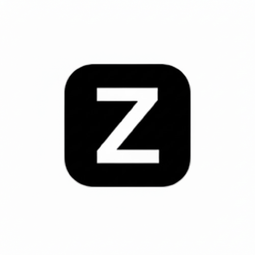
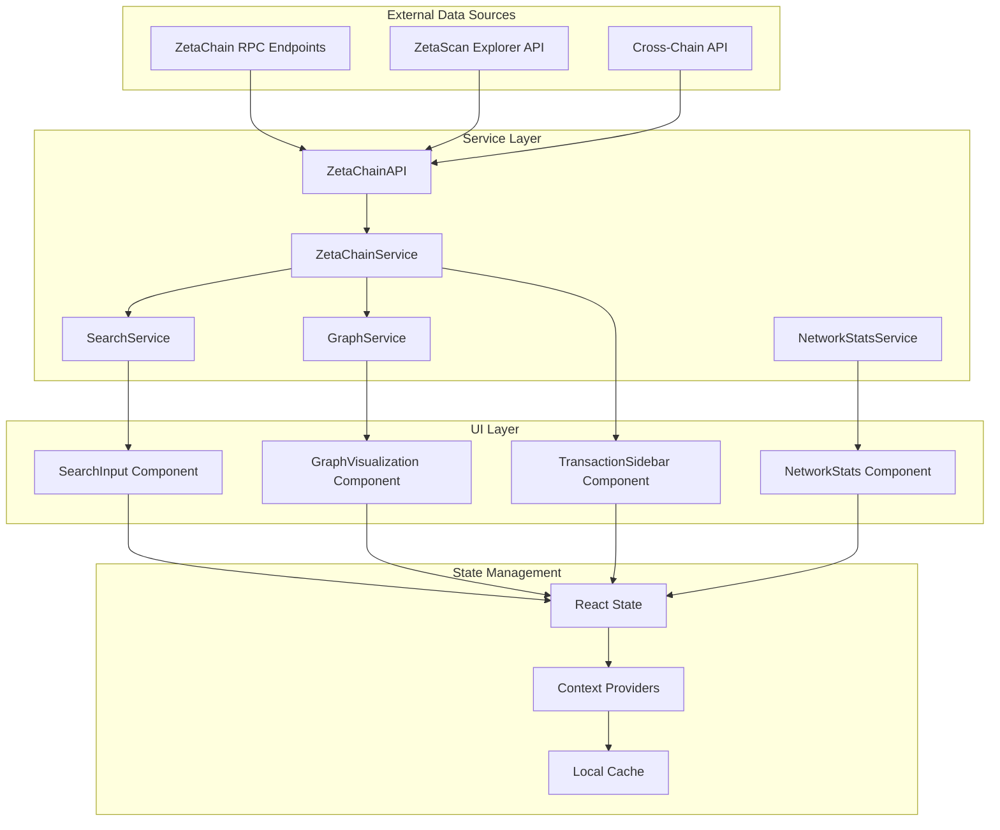

<div align="center">
  
  
  # ZetaFlow - Cross-Chain Transaction Visualizer
</div>

A professional web application for exploring and analyzing cross-chain transactions on the ZetaChain ecosystem. ZetaFlow provides interactive graph-based visualization of transaction flows across chains, helping developers, auditors, and community members understand complex cross-chain movements.

## Overview

ZetaFlow enables users to search for transactions by transaction ID or wallet address and visualize the cross-chain flow through an intuitive, interactive graph interface. The application supports both ZetaChain mainnet and testnet environments with real-time data fetching and comprehensive transaction analysis.

## Key Features

- **Transaction Search**: Search by transaction hash or wallet address across ZetaChain networks
- **Interactive Graph Visualization**: Dynamic graph rendering with Cytoscape.js showing transaction flows
- **Network Support**: Toggle between ZetaChain mainnet and testnet environments  
- **Real-time Data**: Live transaction data from ZetaChain RPC endpoints and ZetaScan Explorer
- **Export Capabilities**: Export visualizations as PNG images or JSON data
- **Wallet Integration**: Connect wallets via WalletConnect for automatic transaction fetching
- **Professional UI**: Clean, light-themed interface optimized for extended use
- **Cross-Chain Analysis**: Comprehensive support for omnichain contracts and cross-chain messaging

## Technology Stack

- **Frontend**: Next.js 15 with App Router and React 19
- **Styling**: TailwindCSS 4 with custom components
- **UI Components**: Radix UI primitives with shadcn/ui
- **Graph Visualization**: Cytoscape.js with multiple layout algorithms
- **Blockchain Integration**: 
  - ethers.js v6 for RPC interactions
  - ZetaChain Toolkit for cross-chain operations
  - WalletConnect v2 with wagmi hooks
- **State Management**: React Context API with TanStack Query for caching
- **Performance**: Optimized with Next.js optimizations and lazy loading

## Getting Started

### Prerequisites

- Node.js 18+ 
- npm, yarn, pnpm, or bun package manager

### Installation

1. Clone the repository:
```bash
git clone https://github.com/Shreyassp002/zetaflow
cd zetaflow
```

2. Install dependencies:
```bash
npm install
# or
yarn install
# or
pnpm install
```

3. Start the development server:
```bash
npm run dev
# or
yarn dev
# or
pnpm dev
```

4. Open [http://localhost:3000](http://localhost:3000) in your browser

## Usage

### Basic Transaction Search

1. **Select Network**: Toggle between mainnet and testnet using the network switch
2. **Search**: Enter a transaction hash or wallet address in the search field
3. **Visualize**: View the interactive graph showing transaction flows and relationships
4. **Analyze**: Click on nodes and edges to view detailed transaction information
5. **Export**: Save visualizations as PNG images or JSON data for further analysis

### Supported Search Formats

- **Transaction Hash**: `0x1234...abcd`
- **Wallet Address**: `0xabcd...1234` 
- **ZetaScan URLs**: Direct links from ZetaScan explorer

### Graph Interaction

- **Pan**: Click and drag to move around the graph
- **Zoom**: Use mouse wheel or pinch gestures to zoom in/out
- **Node Selection**: Click on transaction or address nodes for details
- **Edge Selection**: Click on transaction edges to view transfer information
- **Layout Options**: Switch between different graph layout algorithms

## Architecture

ZetaFlow follows a layered architecture with clear separation between data sources, service layer, and UI components. The application is designed for scalability, performance, and maintainability.

### High-Level Architecture

> **Note**: The diagram below shows the complete data flow from external APIs to frontend components. If the diagram doesn't render, view it on GitHub or in a Mermaid-compatible viewer.



### Component Structure

```
src/
├── app/                    # Next.js App Router pages
├── components/
│   ├── layout/            # Layout components (Header, AppLayout)
│   ├── search/            # Search input and results
│   ├── sidebar/           # Transaction details and network stats
│   ├── visualization/     # Graph components and controls
│   ├── ui/               # Reusable UI components
│   └── providers/        # Context providers and toast notifications
├── lib/
│   ├── blockchain/       # ZetaChain service integration
│   ├── search/          # Search service and validation
│   ├── visualization/   # Graph processing and utilities
│   └── network/         # Network statistics and monitoring
```

### Data Flow

1. **Search Input** → Validation → ZetaChain API calls
2. **Transaction Data** → Graph Processing → Cytoscape.js Rendering  
3. **User Interactions** → Event Handling → Sidebar Updates
4. **Export Actions** → Data Serialization → File Downloads

### Key Architecture Features

- **Multi-layer Caching**: 5-minute service cache, 1-minute search cache, 30-second network stats cache
- **Error Resilience**: Retry logic with exponential backoff and graceful fallbacks
- **Network Intelligence**: Automatic network detection and switching suggestions
- **Performance Optimized**: Lazy loading, parallel API calls, and efficient state management

For detailed architecture documentation, see [ARCHITECTURE.md](./ARCHITECTURE.md).

## ZetaChain Integration

### Supported Networks

- **Mainnet**: ZetaChain production network
- **Testnet**: ZetaChain Athens-3 testnet

### API Endpoints

- **EVM RPC**: Direct blockchain data access
- **Cross-Chain API**: ZetaChain cross-chain transaction data
- **ZetaScan Explorer**: Pre-indexed transaction relationships

### Features Supported

- EVM transaction visualization
- Cross-chain transaction tracking
- Omnichain contract interactions
- Cross-chain messaging flows
- Multi-chain transaction relationships

## Development

### Project Structure

The application follows a modular architecture with clear separation of concerns:

- **UI Layer**: React components with clean, professional styling
- **Service Layer**: ZetaChain integration and data processing
- **Data Layer**: API interactions and local caching

### Key Services

- **SearchService**: Handles transaction and address queries
- **ZetaChainService**: Manages blockchain data fetching
- **GraphService**: Processes data for visualization
- **NetworkStatsService**: Provides network information

### Build Commands

```bash
# Development server with Turbopack
npm run dev

# Production build
npm run build

# Start production server  
npm run start

# Lint code
npm run lint
```

## Performance Optimizations

- **Code Splitting**: Lazy loading of graph visualization components
- **Caching**: TanStack Query for API response caching
- **Bundle Optimization**: Tree shaking and dynamic imports
- **Graph Rendering**: Optimized Cytoscape.js configuration
- **Memory Management**: Efficient data structures and cleanup

## Browser Support

- Chrome 90+
- Firefox 88+
- Safari 14+
- Edge 90+

## Contributing

1. Fork the repository
2. Create a feature branch: `git checkout -b feature/new-feature`
3. Commit changes: `git commit -am 'Add new feature'`
4. Push to branch: `git push origin feature/new-feature`
5. Submit a pull request

## License

This project is licensed under the MIT License - see the LICENSE file for details.

## Acknowledgments

- Built for the ZetaChain ecosystem
- Powered by ZetaChain RPC and ZetaScan Explorer APIs
- Uses ZetaChain Toolkit for cross-chain functionality
- Graph visualization powered by Cytoscape.js

## Support

For questions, issues, or feature requests:

- Create an issue on GitHub
- Check the detailed architecture documentation in [ARCHITECTURE.md](./ARCHITECTURE.md)
- Review the component specifications in `.kiro/specs/`

## Deployment

### Vercel (Recommended)

1. Connect your GitHub repository to Vercel
2. Configure build settings:
   - Build Command: `npm run build`
   - Output Directory: `.next`
3. Deploy automatically on push to main branch

### Other Platforms

The application can be deployed on any platform supporting Next.js applications:
- Netlify
- AWS Amplify  
- Railway
- DigitalOcean App Platform

---

**Built for ZetaChain Hackathon** - Advancing cross-chain transaction analysis and visualization